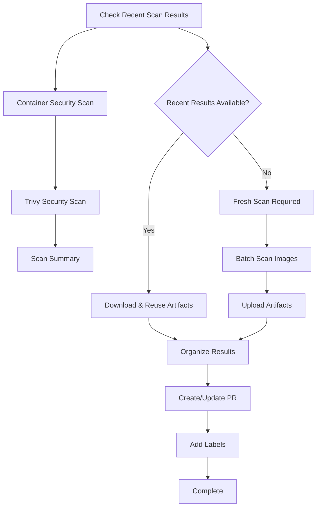
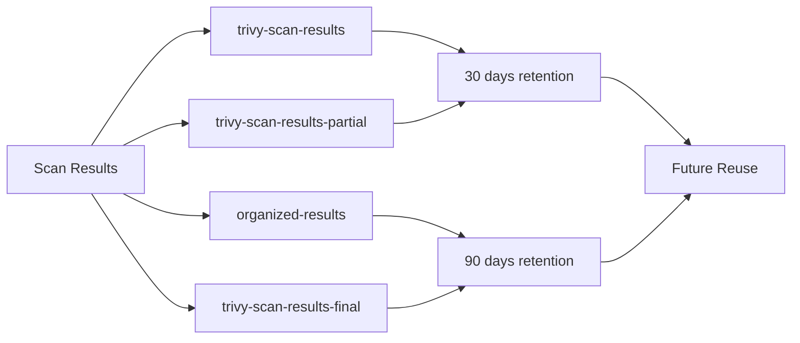

# Trivy Security Scan Workflow

## Overview

The Trivy Security Scan workflow is an automated security scanning system that performs comprehensive vulnerability assessments of all container images in the `products/bfx/` namespace. It uses [Trivy](https://trivy.dev/) to scan for CRITICAL and HIGH severity vulnerabilities and automatically creates pull requests with the results.

## Key Features

- 🔄 **Automated Monthly Scans**: Runs on the first Sunday of every month
- ⚡ **Intelligent Artifact Reuse**: Reuses previous scan results to save time (2-3 hours → 30 seconds)
- 🛡️ **Robust Resume Capability**: Can resume from interruptions and handle failures gracefully
- 📊 **Comprehensive Reporting**: Organizes results by tool with detailed vulnerability information
- 🔧 **Smart Directory Matching**: Automatically maps container images to tool directories
- 🧠 **Intelligent PR Creation**: Only creates PRs for meaningful changes, eliminates noise
- 📝 **Smart PR Management**: Auto-assigns to @gkr0110 with severity-based labels and titles
- 📋 **Comprehensive Audit Trail**: Maintains compliance records even when no PR is created

## Workflow Triggers

### Scheduled Execution
```yaml
schedule:
  # Run on the first Sunday of every month at 2:00 AM UTC
  - cron: "0 2 1-7 * 0"
```

### Manual Execution
The workflow can be triggered manually with various options:

- **Debug Mode**: Enable detailed troubleshooting output
- **Force Fresh Scan**: Skip artifact reuse and perform complete scan
- **Disable Recent Check**: Always perform fresh scan
- **Resume from Progress**: Continue from previous checkpoint (default: enabled)
- **Skip to Organize**: Use existing scan results and skip scanning

## Architecture

### Job Structure



### Artifact Strategy



## Detailed Workflow Steps

### 1. Check Recent Scan Results
- Searches for successful workflow runs within the last week
- Downloads artifacts from recent runs if available
- Falls back to partial results from failed runs

### 2. Container Security Scan
- Discovers all container images in `products/bfx/*` namespace
- Creates mapping between tools and their container images
- Handles authentication with GitHub Container Registry

### 3. Trivy Security Scan
- **Reuse Path**: Uses downloaded artifacts (completes in ~30 seconds)
- **Fresh Scan Path**: Scans all discovered images (takes 2-3 hours)
- Implements checkpoint/resume system for reliability
- Uploads artifacts after every successful scan

### 4. Organize Results
- Groups scan results by tool
- Creates comprehensive JSON files with vulnerability details
- Includes version information and vulnerability counts
- Uploads organized results as artifacts

### 5. Intelligent PR Creation
- **Change Detection**: Analyzes scan results for meaningful changes (excludes metadata)
- **Conditional Creation**: Only creates PRs when vulnerabilities or versions change
- **Smart Titles**: Generates context-aware titles based on change types
- **Auto-Assignment**: Assigns all PRs to @gkr0110 for security review
- **Intelligent Labels**: Adds severity and change-type based labels
- **Audit Trail**: Updates compliance records even when no PR is created

## File Structure

### Input Files
- `images_to_scan.txt`: List of discovered container images
- `tool_images_mapping.json`: Mapping of tools to their images

### Progress Tracking
- `scan_progress.txt`: Detailed log of scan operations
- `completed_scans.txt`: List of successfully scanned images
- `failed_scans.txt`: List of failed scans

### Output Files
- `trivy-results/trivy-*.json`: Individual scan results per image
- `organized-results/*-trivy-scan-results.json`: Results organized by tool
- `bfx/*/trivy-scan-results.json`: Final results in tool directories
- `.github/security-scan-audit.json`: Comprehensive audit trail and compliance record

## Artifact Types

### Primary Artifacts
1. **trivy-scan-results**: Complete scan results from successful runs
2. **trivy-scan-results-partial**: Partial results from interrupted runs
3. **organized-results**: Final organized results by tool
4. **trivy-scan-results-final**: Safety backup with all files

### Retention Policy
- **Scan Results**: 30 days (frequent reuse)
- **Organized Results**: 90 days (long-term reference)

## Configuration

### Environment Variables
- `GITHUB_TOKEN`: Required for API access and PR creation
- `PACKAGES_TOKEN`: Optional personal access token for enhanced package access

### Workflow Inputs
- `debug_mode`: Enable debug output
- `force_fresh_scan`: Skip artifact reuse
- `disable_recent_check`: Always perform fresh scan
- `resume_from_progress`: Resume from checkpoints
- `skip_to_organize`: Use existing results

## Intelligent Change Detection

### Change Analysis
- **Content-Based Comparison**: Excludes metadata (timestamps, run IDs) from change detection
- **Vulnerability Tracking**: Detects new/resolved CRITICAL and HIGH vulnerabilities
- **Version Management**: Identifies new/removed container versions
- **Tool-Level Analysis**: Determines which specific tools are affected

### PR Creation Logic
```bash
# PR created only for meaningful changes:
✅ New CRITICAL vulnerabilities detected
✅ New HIGH vulnerabilities detected  
✅ Vulnerabilities resolved
✅ New container versions scanned
✅ Container versions removed

# PR NOT created for:
❌ Metadata-only changes (timestamps, run IDs)
❌ Identical vulnerability data
❌ No version changes
```

### Smart PR Features
- **Dynamic Titles**: `🚨 CRITICAL vulnerabilities detected in 3 tools`
- **Severity Labels**: `critical`, `urgent`, `high-priority` based on impact
- **Change Labels**: `vulnerabilities`, `new-versions` based on content
- **Auto-Assignment**: All PRs assigned to @gkr0110
- **Detailed Analysis**: Impact summary with affected tools and counts

## Error Handling

### Robust Recovery
- **Network Issues**: Automatic retries with exponential backoff
- **Scan Failures**: Individual image failures don't stop the workflow
- **Directory Issues**: Smart directory matching with fuzzy logic
- **Branch Conflicts**: Handles existing branches and PRs gracefully
- **Artifact Issues**: Multiple fallback artifact sources
- **Change Detection**: Graceful fallback if comparison fails

### Checkpoint System
- Progress saved after every 5 successful scans
- Can resume from any interruption point
- Preserves partial results even if workflow fails
- Audit trail maintained regardless of workflow outcome

## Performance Optimization

### Time Savings
- **Fresh Scan**: 2-3 hours (63 images)
- **Artifact Reuse**: 30 seconds
- **Partial Resume**: Variable based on progress

### Resource Efficiency
- Parallel scanning with resource limits
- Intelligent caching of Trivy database
- Compressed artifacts to save storage

## Security Considerations

### Vulnerability Scope
- **Severity Levels**: CRITICAL and HIGH only
- **Image Types**: All container images in products/bfx/ namespace
- **Update Frequency**: Monthly automated scans

### Access Control
- Uses GitHub Actions built-in permissions
- Requires `contents: write`, `packages: read`, `pull-requests: write`
- Supports both GITHUB_TOKEN and personal access tokens

## Monitoring and Alerts

### Success Indicators
- ✅ All artifacts uploaded successfully
- ✅ Audit trail updated with scan results
- ✅ PR created only when meaningful changes detected
- ✅ No CRITICAL vulnerabilities blocking deployment

### Workflow Outcomes
- 🎯 **PR Created**: Meaningful changes detected (vulnerabilities/versions)
- ⏭️ **No PR Created**: Only metadata changes, audit trail updated
- ✅ **Scan Completed**: All tools scanned successfully
- 📊 **Artifacts Preserved**: Results available for future reuse

### Failure Scenarios
- ❌ No container images discovered
- ❌ All scans failed
- ❌ Change detection failed
- ❌ Artifact upload failed

## Usage Examples

### Manual Trigger with Options
```bash
# Force fresh scan
gh workflow run "Trivy Security Scan" -f force_fresh_scan=true

# Debug mode
gh workflow run "Trivy Security Scan" -f debug_mode=true

# Skip to organize existing results
gh workflow run "Trivy Security Scan" -f skip_to_organize=true
```

### Reviewing Results
1. Check the created/updated PR for scan summary
2. Review individual tool results in `bfx/*/trivy-scan-results.json`
3. Address CRITICAL vulnerabilities first
4. Plan container image updates for affected versions

## Troubleshooting

### Common Issues

#### No Images Discovered
```
⚠ No container images found to scan
→ Verify images are published to ghcr.io with products/bfx/ prefix
→ Check repository permissions for package access
```

#### Scan Failures
```
✗ Scan failed - continuing with next image
→ Check network connectivity
→ Verify image accessibility
→ Review Trivy configuration
```

#### Directory Matching Issues
```
✗ No matching directory found for tool: toolname
→ Check if bfx/toolname/ directory exists
→ Verify tool name matches directory structure
```

### Debug Mode
Enable debug mode for detailed troubleshooting:
- Shows API responses
- Lists available artifacts
- Displays directory matching logic
- Provides comprehensive error context

## Contributing

### Adding New Tools
1. Ensure container images follow `products/bfx/toolname` pattern
2. Create corresponding `bfx/toolname/` directory
3. Workflow will automatically discover and scan new tools

### Modifying Scan Parameters
- Update severity levels in Trivy command
- Adjust timeout values for large images
- Modify retention periods for artifacts

## Audit Trail and Compliance

### Audit File Structure
The workflow maintains a comprehensive audit trail in `.github/security-scan-audit.json`:

```json
{
  "last_scan_timestamp": "2025-01-06T02:56:21Z",
  "last_scan_run_id": "18268674820",
  "last_change_detected": "2025-01-05T18:31:37Z",
  "scan_history": [
    {
      "timestamp": "2025-01-06T02:56:21Z",
      "run_id": "18268674820",
      "tools_scanned": 21,
      "changes_detected": false,
      "pr_created": false,
      "affected_tools": [],
      "change_types": []
    }
  ],
  "tools_last_scanned": {
    "bcftools": "2025-01-06T02:56:21Z",
    "bedtools": "2025-01-06T02:56:21Z"
  }
}
```

### Compliance Benefits
- **Regulatory Compliance**: Proof of regular security scanning
- **Audit Trail**: Complete history of all scan activities
- **Change Tracking**: Record of when vulnerabilities were detected/resolved
- **Tool Coverage**: Verification that all tools are being scanned
- **Performance Metrics**: Scan duration and success rates

### Noise Reduction Strategy
- **Intelligent Filtering**: Only creates PRs for actionable changes
- **Metadata Exclusion**: Ignores timestamp and run ID changes
- **Content Focus**: Concentrates on actual vulnerability changes
- **Audit Preservation**: Maintains compliance records without PR noise

## Related Documentation

- [Trivy Documentation](https://trivy.dev/)
- [GitHub Actions Workflow Syntax](https://docs.github.com/en/actions/using-workflows/workflow-syntax-for-github-actions)
- [GitHub Container Registry](https://docs.github.com/en/packages/working-with-a-github-packages-registry/working-with-the-container-registry)

---

*This workflow was designed to provide comprehensive, automated security scanning with maximum reliability and minimal maintenance overhead.*