# Trivy Security Scan Workflow - Detailed Flow Diagram

## Complete Workflow Flow

```mermaid
flowchart TD
    Start([Workflow Triggered]) --> Trigger{Trigger Type}
    
    Trigger -->|Scheduled| Schedule[First Sunday of Month<br/>2:00 AM UTC]
    Trigger -->|Manual| Manual[Manual Trigger<br/>with Options]
    
    Schedule --> CheckRecent[Check Recent Scan Results]
    Manual --> CheckRecent
    
    CheckRecent --> RecentAPI[Query GitHub API<br/>for Recent Runs]
    RecentAPI --> RecentFound{Recent Success<br/>Found?}
    
    RecentFound -->|Yes| DownloadArtifacts[Download Recent Artifacts]
    RecentFound -->|No| CheckFailed[Check Failed Runs<br/>for Partial Results]
    
    CheckFailed --> PartialFound{Partial Results<br/>Available?}
    PartialFound -->|Yes| DownloadPartial[Download Partial Artifacts]
    PartialFound -->|No| FreshScan[Fresh Scan Required]
    
    DownloadArtifacts --> SecurityScan[Container Security Scan]
    DownloadPartial --> SecurityScan
    FreshScan --> SecurityScan
    
    SecurityScan --> DiscoverImages[Discover Container Images<br/>from products/bfx/*]
    DiscoverImages --> ImageCount{Images Found?}
    
    ImageCount -->|No| NoImages[❌ No Images Found<br/>Workflow Fails]
    ImageCount -->|Yes| CreateMapping[Create Tool-Image Mapping]
    
    CreateMapping --> TrivyScan[Trivy Security Scan Job]
    
    TrivyScan --> ReuseCheck{Reuse Available?}
    
    ReuseCheck -->|Yes| PrepareRecent[Prepare Recent Results]
    ReuseCheck -->|No| BatchScan[Batch Scan Images]
    
    PrepareRecent --> CopyResults[Copy Downloaded Results<br/>to trivy-results/]
    CopyResults --> OrganizeResults
    
    BatchScan --> ScanLoop[Scan Each Image<br/>with Trivy]
    ScanLoop --> ScanResult{Scan Success?}
    
    ScanResult -->|Success| SaveResult[Save JSON Result<br/>Update Progress]
    ScanResult -->|Failure| LogFailure[Log Failure<br/>Continue Next]
    
    SaveResult --> UploadProgress[Upload Artifacts<br/>Every 5 Scans]
    LogFailure --> MoreImages{More Images?}
    UploadProgress --> MoreImages
    
    MoreImages -->|Yes| ScanLoop
    MoreImages -->|No| FinalUpload[Upload Final Artifacts<br/>trivy-scan-results]
    
    FinalUpload --> OrganizeResults[Organize Scan Results by Tool]
    
    OrganizeResults --> ProcessTools[Process Each Tool<br/>Group by Versions]
    ProcessTools --> CreateToolJSON[Create Tool-Specific<br/>JSON Files]
    CreateToolJSON --> UploadOrganized[Upload Organized Results<br/>organized-results]
    
    UploadOrganized --> CreatePR[Create Pull Request]
    
    CreatePR --> BackupDir[Backup organized-results<br/>to /tmp/]
    BackupDir --> GitOps[Git Operations<br/>Branch Management]
    
    GitOps --> BranchExists{Branch Exists?}
    BranchExists -->|Yes| UpdateBranch[Switch to Branch<br/>Reset to Main]
    BranchExists -->|No| CreateBranch[Create New Branch]
    
    UpdateBranch --> RestoreBackup[Restore organized-results<br/>from Backup]
    CreateBranch --> RestoreBackup
    
    RestoreBackup --> CopyToTools[Copy Results to<br/>bfx/*/trivy-scan-results.json]
    CopyToTools --> DirectoryMatch[Smart Directory Matching<br/>Fuzzy + Reverse Match]
    
    DirectoryMatch --> MatchFound{Directory<br/>Match Found?}
    MatchFound -->|Yes| CopyFile[Copy Scan Results<br/>Git Add File]
    MatchFound -->|No| SkipTool[Skip Tool<br/>Log Warning]
    
    CopyFile --> MoreTools{More Tools?}
    SkipTool --> MoreTools
    
    MoreTools -->|Yes| CopyToTools
    MoreTools -->|No| ChangeDetection[🧠 Intelligent Change Detection<br/>Analyze Content vs Metadata]
    
    ChangeDetection --> CompareContent[Compare Normalized Content<br/>Exclude Timestamps & Run IDs]
    CompareContent --> AnalyzeChanges[Analyze Vulnerability Changes<br/>Count CRITICAL/HIGH Changes]
    AnalyzeChanges --> CheckVersions[Check Version Changes<br/>New/Removed Containers]
    
    CheckVersions --> MeaningfulChanges{Meaningful<br/>Changes?}
    
    MeaningfulChanges -->|Yes| CommitChanges[Git Commit Changes<br/>+ Update Audit Trail]
    MeaningfulChanges -->|No| AuditOnly[Update Audit Trail Only<br/>No PR Creation]
    
    AuditOnly --> AuditCommit[Commit Audit Trail<br/>Push to Branch]
    AuditCommit --> NoProSuccess[✅ Workflow Success<br/>No PR Created]
    
    CommitChanges --> PushBranch[Push Branch<br/>Handle Conflicts]
    PushBranch --> GenerateSmartPR[Generate Smart PR<br/>Title & Description]
    
    GenerateSmartPR --> PRExists{PR Exists?}
    
    PRExists -->|Yes| UpdatePR[Update Existing PR<br/>Smart Title & Content]
    PRExists -->|No| CreateNewPR[Create New PR<br/>Assign to @gkr0110]
    
    UpdatePR --> SmartLabels[Add Intelligent Labels<br/>Based on Change Types]
    CreateNewPR --> SmartLabels
    
    SmartLabels --> SeverityLabels[Add Severity Labels<br/>critical, urgent, high-priority]
    SeverityLabels --> ChangeLabels[Add Change Labels<br/>vulnerabilities, new-versions]
    
    ChangeLabels --> Success[🎉 Workflow Success<br/>Smart PR Created]
    NoProSuccess --> End([Workflow Complete])
    Success --> End
    
    Success --> Summary[Display Summary<br/>- Tools Scanned<br/>- PR Created<br/>- Artifacts Saved]
    
    Summary --> End([Workflow Complete])
    NoImages --> End
    
    %% Styling
    classDef successClass fill:#d4edda,stroke:#155724,stroke-width:2px
    classDef errorClass fill:#f8d7da,stroke:#721c24,stroke-width:2px
    classDef processClass fill:#e2e3e5,stroke:#383d41,stroke-width:2px
    classDef decisionClass fill:#fff3cd,stroke:#856404,stroke-width:2px
    
    class Success,LabelsOK,Summary successClass
    class NoImages errorClass
    class CheckRecent,SecurityScan,TrivyScan,OrganizeResults,CreatePR processClass
    class RecentFound,PartialFound,ImageCount,ReuseCheck,ScanResult,MoreImages,MoreTools,BranchExists,MatchFound,PRExists,LabelResult decisionClass
```

## Intelligent Change Detection Flow

```mermaid
flowchart TD
    Start[Scan Results Ready] --> NormalizeContent[Normalize JSON Content<br/>Remove Metadata]
    
    NormalizeContent --> ExtractOld[Extract Old Content<br/>from main branch]
    ExtractOld --> ExtractNew[Extract New Content<br/>from current scan]
    
    ExtractNew --> CompareContent{Content<br/>Identical?}
    
    CompareContent -->|Yes| NoChanges[No Meaningful Changes<br/>Metadata Only]
    CompareContent -->|No| AnalyzeChanges[Analyze Change Types]
    
    AnalyzeChanges --> CheckVulns[Check Vulnerability Changes<br/>CRITICAL vs HIGH counts]
    CheckVulns --> CheckVersions[Check Version Changes<br/>New/Removed containers]
    CheckVersions --> CheckTools[Identify Affected Tools]
    
    CheckTools --> ClassifyChanges[Classify Change Severity]
    
    ClassifyChanges --> CriticalFound{CRITICAL<br/>Changes?}
    CriticalFound -->|Yes| UrgentPR[🚨 Create URGENT PR<br/>critical + urgent labels]
    CriticalFound -->|No| HighFound{HIGH<br/>Changes?}
    
    HighFound -->|Yes| HighPriorityPR[⚠️ Create HIGH Priority PR<br/>high-priority label]
    HighFound -->|No| VersionChanges{Version<br/>Changes?}
    
    VersionChanges -->|Yes| VersionPR[📦 Create Version PR<br/>new-versions label]
    VersionChanges -->|No| ResolvedVulns{Vulnerabilities<br/>Resolved?}
    
    ResolvedVulns -->|Yes| ResolvedPR[✅ Create Resolution PR<br/>vulnerabilities label]
    ResolvedVulns -->|No| NoChanges
    
    NoChanges --> UpdateAudit[Update Audit Trail<br/>Record Scan Activity]
    UpdateAudit --> NoProResult[⏭️ No PR Created<br/>Audit Trail Updated]
    
    UrgentPR --> AssignPR[Auto-assign to @gkr0110<br/>Add Smart Labels]
    HighPriorityPR --> AssignPR
    VersionPR --> AssignPR
    ResolvedPR --> AssignPR
    
    AssignPR --> SmartTitle[Generate Smart Title<br/>Based on Changes]
    SmartTitle --> DetailedBody[Generate Detailed Body<br/>Impact Analysis]
    DetailedBody --> PRCreated[✅ Smart PR Created]
    
    %% Styling
    classDef urgentClass fill:#ffebee,stroke:#c62828,stroke-width:2px
    classDef highClass fill:#fff3e0,stroke:#ef6c00,stroke-width:2px
    classDef versionClass fill:#e8f5e8,stroke:#2e7d32,stroke-width:2px
    classDef noChangeClass fill:#f3e5f5,stroke:#7b1fa2,stroke-width:2px
    classDef successClass fill:#e1f5fe,stroke:#0277bd,stroke-width:2px
    
    class UrgentPR urgentClass
    class HighPriorityPR highClass
    class VersionPR,ResolvedPR versionClass
    class NoChanges,NoProResult noChangeClass
    class PRCreated,AssignPR,SmartTitle,DetailedBody successClass
```

## Artifact Flow Diagram

```mermaid
flowchart LR
    subgraph "Scan Phase"
        A[Individual Scans] --> B[trivy-*.json files]
        B --> C[trivy-scan-results<br/>artifact]
        B --> D[trivy-scan-results-partial<br/>artifact]
    end
    
    subgraph "Organization Phase"
        E[Tool Grouping] --> F[*-trivy-scan-results.json]
        F --> G[organized-results<br/>artifact]
    end
    
    subgraph "Final Phase"
        H[All Files] --> I[trivy-scan-results-final<br/>artifact]
    end
    
    subgraph "Reuse Logic"
        C --> J{Next Run}
        D --> J
        G --> J
        I --> J
        J --> K[Download & Reuse<br/>⚡ 30 seconds vs 3 hours]
    end
    
    subgraph "Retention"
        C --> L[30 days]
        D --> L
        G --> M[90 days]
        I --> M
    end
    
    %% Styling
    classDef artifactClass fill:#e1f5fe,stroke:#0277bd,stroke-width:2px
    classDef reuseClass fill:#e8f5e8,stroke:#2e7d32,stroke-width:2px
    classDef retentionClass fill:#fff3e0,stroke:#ef6c00,stroke-width:2px
    
    class C,D,G,I artifactClass
    class J,K reuseClass
    class L,M retentionClass
```

## Error Handling Flow

## Performance Comparison

---

*These diagrams provide a comprehensive view of the Trivy Security Scan workflow, showing all decision points, error handling, and optimization strategies.*